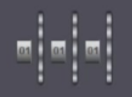

这节课主要学习了多表加密的enigma加密机。

## Machine Structure

Enigma加密机的主要需要关注的结构是五个具有信息映射功能的**齿轮**，以及一个**插线板**

Enigma提供的加密信息密度主要来源于以下几个结构：

- **Message Key**
- **Ring Setting**
- **Rotor Pattern**
- **Plug Board**

本节课将主要介绍有关**Message Key**与**Rotor Pattern**的部分

## Rotor Pattern 
Enigma加密机有5个特殊的齿轮，他们的功能一方面是将输入的字符进行一个映射，另一方面是作为机构件
来驱动下一个齿轮的转动

而实际上，同时最多使用3个齿轮，同时与顺序有关，那么这里的选择就可以有$A_5^3$中可能性(具体的映射关系下一节课会给出)，这里的排列被称作**Rotor Pattern**

输入的字符会从左到右依次经过三个齿轮，接着会经过一个特殊的映射表 **reflector** ，接着，输入的字符会按原路返回，最终输出为密文，有如下示意图：

```typst
#import "@preview/cetz:0.2.2": canvas, draw

#align(center)[
  #canvas(length: 1.2cm, {
    import draw: *

    // 全局样式设置
    set-style(
      rect: (stroke: 1.2pt, radius: 0.1),
      line: (stroke: 1.2pt),
      mark: (fill: auto)
    )

    // ==========================================
    // 1. 绘制基本结构 (从左到右: 反射板 -> 左齿轮 -> 中齿轮 -> 右齿轮)
    // ==========================================
    
    let col(chars) = stack(
      dir: ttb,
      spacing: 0.15em, // 进一步缩小纵向间距以容纳更多字符
      ..chars.map(c => text(size: 0.55em, font: "Courier", weight: "bold", c))
    )

    // 2. 增加字符数量 (展示 A-F, 省略号, Y-Z)
    let pre   = col(("A","B","C","D","E","F","G","H","I","J","K","L","M",":","Y","Z"))
    // Rotor I 的实际内部硬连线 (Map 后)
    let post1 = col(("E","K","M","F","L","G","D","Q","V","Z","N","T","O",":","C","J")) 
    // Rotor II 的实际内部硬连线
    let post2 = col(("A","J","D","K","S","I","R","U","X","B","L","H","W",":","O","E")) 
    // Rotor III 的实际内部硬连线
    let post3 = col(("B","D","F","H","J","L","C","P","R","T","X","V","Z",":","Q","O")) 
    // UKW-B (B型反射板) 的真实连线对
    let postU = col(("Y","R","U","H","Q","S","L","D","P","X","N","G","O",":","A","T"))

    // ==========================================
    // 3. 绘制方框并调整左右字符间距 (向中心靠拢)
    // 每个方框宽度为 1.5，中心点偏移量设为 0.25
    // ==========================================

    // 反射板 (Reflector / UKW) - 中心 0.75
    rect((0, -2.5), (1.5, 2.5), name: "UKW", fill: rgb("f0f0f0"))
    content((0.75, -3), [*Reflector*])
    content((0.5, 0), postU) // 靠左 (中心0.75 - 0.25)
    content((1.0, 0), pre)   // 靠右 (中心0.75 + 0.25)
    
    // 左侧齿轮 (Rotor III) - 中心 3.25
    rect((2.5, -2.5), (4, 2.5), name: "RL", fill: rgb("e6f2ff"))
    content((3.25, -3), [*Rotor III*])
    content((3.0, 0), post3) 
    content((3.5, 0), pre)

    // 中间齿轮 (Rotor II) - 中心 5.75
    rect((5, -2.5), (6.5, 2.5), name: "RM", fill: rgb("e6f2ff"))
    content((5.75, -3), [*Rotor II*])
    content((5.5, 0), post2)
    content((6.0, 0), pre)

    // 右侧齿轮 (Rotor I) - 中心 8.25
    rect((7.5, -2.5), (9, 2.5), name: "RR", fill: rgb("e6f2ff"))
    content((8.25, -3), [*Rotor I*])
    content((8.0, 0), post1)
    content((8.5, 0), pre)

    // 接线板分割线
    line((10, -2.7), (10, 2.7), stroke: (dash: "dashed", thickness: 1.5pt))
    content((10, 3.3), [*Plugboard*])

    // ==========================================
    // 2. 绘制正向电流路径 (红色: 键盘输入 -> 反射板)
    // ==========================================
    set-style(line: (stroke: (paint: red, thickness: 1.2pt), mark: (end: ">")))
    
    // 键入输入
    content((12, 1.5), text(fill: red, weight: "bold", [*Plain*]))
    line((10.5, 1.5), (9, 1.5))
    
    // 触点传递: R -> M
    line((7.5, 0.5), (6.5, 0.5)) 

    // 触点传递: M -> L
    line((5, 1.8), (4, 1.8)) 

    // 触点传递: L -> 反射板
    line((2.5, 0.8), (1.5, 0.8)) 

    set-style(line: (stroke: (paint: blue, thickness: 1.2pt), mark: (end: ">")))

    // 触点传递: 反射板 -> L
    line((1.5, -1), (2.5, -1))
    
    // 触点传递: L -> M
    line((4, -2), (5, -2)) 

    // 触点传递: M -> R
    line((6.5, -0.5), (7.5, -0.5)) 

    
    // 传导至接线板并输出灯光信号
    line((9, -1.8), (10.5, -1.8))
    content((12, -1.8), text(fill: blue, weight: "bold", [*Cipher*]))
  })
]
```
::fold{title="**About the details**" expand  info always}
1. Enigma加密是可逆的
2. 基于Enigma的可逆性，reflector的映射有一定要求，观察就可以发现所有的映射关系都是两两对应
3. 基于Enigma的可逆性，字符信息进入与出机器的两个过程都需要经过Plugboard的处理
4. 基于Enigma的可逆性，正向加密与反向加密经过的字符映射表是相反的
5. 实际上，传入的信息是电信号的形式，这一点利用Plugboard更容易理解，下节课会详细说明
::

## Message Key

那么所谓的**Message Key**指的是什么呢？这需要考虑实际的物理因素设计

每一个齿轮被设置成26个字符为一个旋转周期，最右侧齿轮在每次输入一个字符的时候都会被转动一次，而当右侧字符转动到某一个凹槽位置的时候，就会带动中间的齿轮转动，类似的，中间的齿轮也是类似的概念，这就类似于26进制的进位

需要注意的是，每一个齿轮的凹槽位置是不一样的，当我们设定一个初始的齿轮情况，如"AAA"(显示为"01 01 01")时，意味着，当前三个齿轮都放到了A的旋转位置:



假设最右侧的齿轮的旋转点在R与S之间，那么我们就能看到，并非是旋转26次一定就会造成一次进位，尤其是在每一个齿轮的第一次旋转之前，这是依赖于这个齿轮的初始状态的

这个初始状态就被称为**Message Key**.