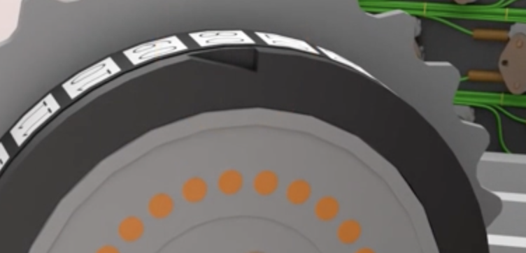
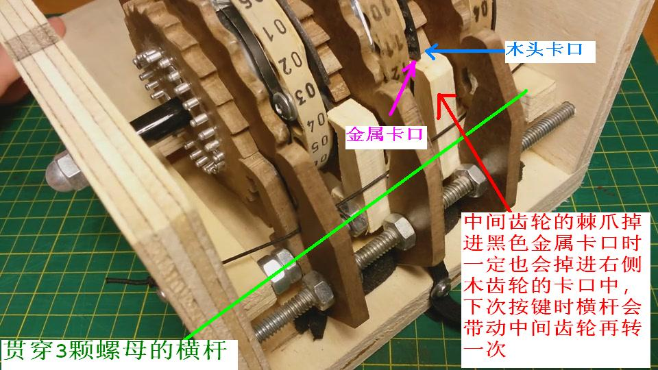

## ring settings
回顾上一周的内容,我们知道选择engima的加密模式存在两种抉择点：
- 齿轮选择与排列
- 齿轮的外部设置，初始状态的设置(也就是外面显示的` 1 1 26 `) 也被成为message key
这里引出另外的一个内部设置项：ring settings 
简单来说，这个 ring setting 就是为外部设置的message key提供了提供了一个delta值
我们来尝试考虑一个场景。
::fold{title="**Example of ring setting**" expand always success}
设3个齿轮从左到右的排列是 3 2 1
的ring setting为：AAB (当敲了一个键的情况下，ring setting并不会改变)
初始message key为：AAZ
1. 按下一个键 `A`：
message key变成：AAA
现在计算messge key - ring setting的差
:::fold{title="**Note**" expand always info}
先改变外部设置再加密
:::
$$
\begin{aligned}
\Delta 1&=\text{ascii A(message)}-\text{ascii B(ring setting)}=-1=25\text{ mod }26 \\
\Delta 2/3&=\text{ascii A}-\text{ascii A}=0
\end{aligned}
$$
2. 查表计算：
:::grid{align=equal gapx=10px gapy=20px}
:sep{span=8}
::::fold{title="**Process**" expand always success}
**in rotor I**:  
A + $\Delta 1$ = Z   
Z map to J  
J - $\Delta 1$ = K    
**in rotor II**:   
K map to L  
**in rotor III**:  
L map to V    
**Reflactor**:  
V map to W    
**in rotor III**:   
W map to R    
**in rotor II**:   
R map to G    
**in rotor I**:    
G + $\Delta 1$ = F    
F map to D    
D - $\Delta 1$ = E    

::::
:sep{span=16}
::::fold{title="**Table**" expand always info}
1. rotor I:
EKMFLGDQVZNTOWYHXUSPAIBRCJ
ABCDEFGHIJKLMNOPQRSTUVWXYZ
2. rotor II
AJDKSIRUXBLHWTMCQGZNPYFVOE  
ABCDEFGHIJKLMNOPQRSTUVWXYZ 
3. rotor III
BDFHJLCPRTXVZNYEIWGAKMUSQO      
ABCDEFGHIJKLMNOPQRSTUVWXYZ
4. reflector
YRUHOSLDPANGOKMIEBFZCWVJAT
ABCDEEGHIJKLMNOPQRSTUVWXYZ
::::
:::
::    

## Plugin board
接线板的作用是影响进入右侧齿轮的信号，同时影响从右侧齿轮出来的信号，但不影响其它齿轮。例如，在保持上述初始设置不变的情况下，把A、B对接，那么在输入B的情况下，输出仍旧是E，因为B先要替换成A才会进入①；同理，把A、B对接，再把E、F也对接，那么在输入B的情况下，输出是F，因为本来的输出信号E要替换成F。

## Gear spining
1～5号齿轮的旋转是基于实际机械结构的，从右侧开始一共有三个棘抓由主轴驱动控制三个齿轮，右侧的棘抓可以保证控制最右侧的轮转动，对于中间部分的控制则是需要满足具体条件的，也就是必须要在旋转到达某一个槽口的时候，棘爪才能驱动旋转

> 这也就意味着并非一定旋转26次就会使得下一级齿轮旋转一次，实际上第一次的旋转是取决于设置的message key的，之后的旋转都是符合26次周期的（一般而言）

对于5个齿轮的槽口具体旋转如下：
```
① ② ③  ④ ⑤
Q  E  V  J  Z
↓  ↓  ↓  ↓  ↓
R  F  W  K  A
```

### Double spinning
基于上面的条件，实际上运行的时候存在一种特殊情况，也就是当最右侧齿轮带动中间齿轮旋转一次之后，中间齿轮刚好位于下一次可以带动最左侧齿轮的情况，此时再输入一次，这时会导致三个齿轮同时旋转：

两次旋转导致了中间齿轮连续两次旋转，也就是Double spinning.