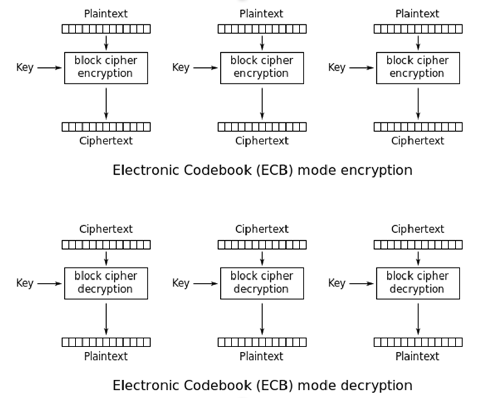
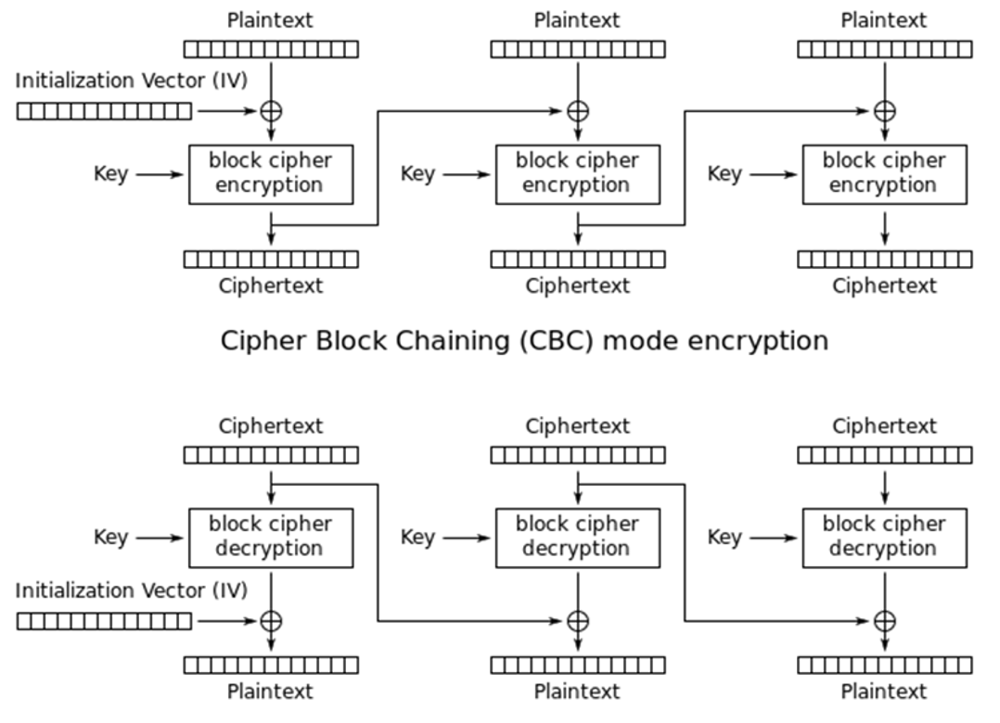
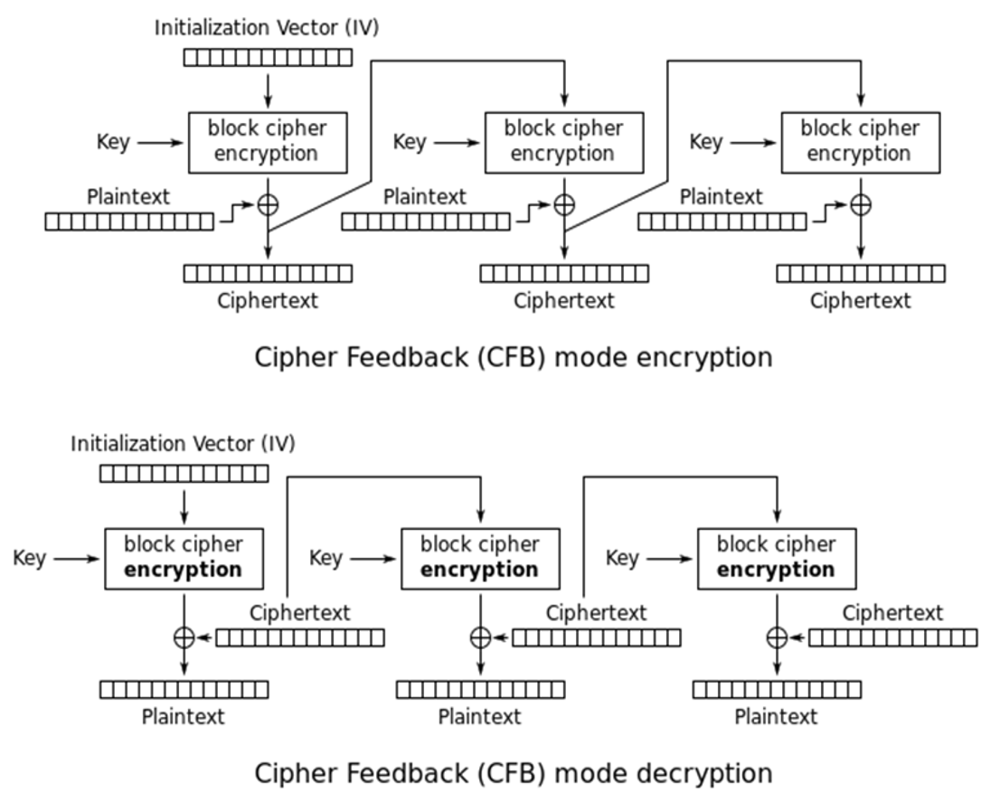

### Electronic codebook(ECB)

::quote
The natural manner for using a block cipher is to break a long piece of plaintext into appropriate sized blocks of plaintext and process each block separately with the encryption function $E_K()$. This is known as the electronic codebook(ECB) mode of operation. 
::

The plaintext P is broken into smaller chunks:

$$   P = [P_1, P_2, ..., P_L]$$

and the ciphertext is:
   $$C = [C_1, C_2, ..., C_L]$$

where $C_j = E_k(P_j)$ is the encryption of $P_j$ using the key K.

电子密码簿ECB 加密过程：$C_j = E_k(P_j)$

电子密码簿ECB 解密过程：$P_j = D_k(C_j)$

电子密码簿模式的弱点是:对于相同内容的明文段，加密后得到的密文块是相同的。

电子密码簿模式的优点是:加密和解密过程均可以并行处理。

### Cipher Block Chaining(CBC)

CBC模式的特点是：当前块的密文与前一块的密文有关; 加密过程只能串行处理; 解密过程可以并行处理;

### Cipher Block Feedback(CBF)

::fold{title="补充说明" expand warning}
加密的逻辑有一些简化，实际上有这么几个注意点：
1. 对于每一个密钥参与的算法的返回值Q，实际上都只会使用Q的第一个字节与P(plaintext)的某一个字节进行异或计算
2. 对于IV的每一轮的变化如下：
$$
\begin{aligned}
IV_1 &= IV[0][1]...[7] \\
\downarrow \\
IV_2 &= IV[1][2]...C[0] \\
\end{aligned}
$$
以此类推
::