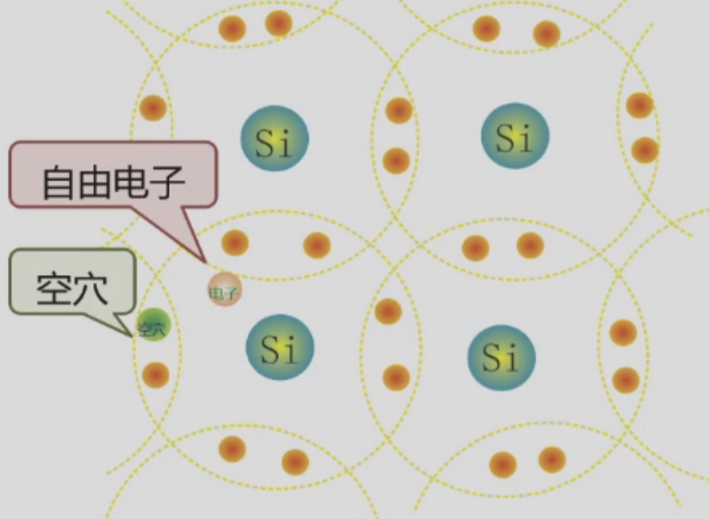
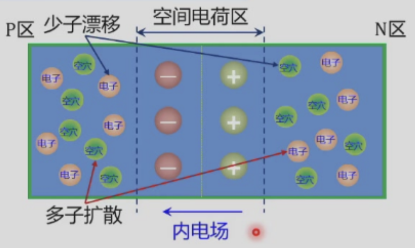
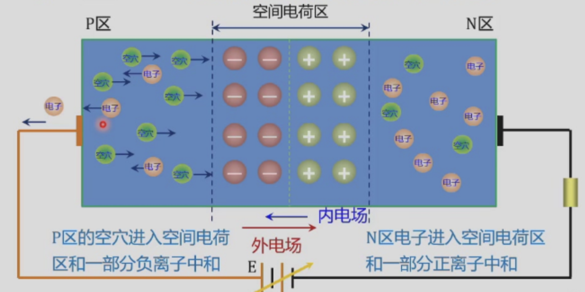
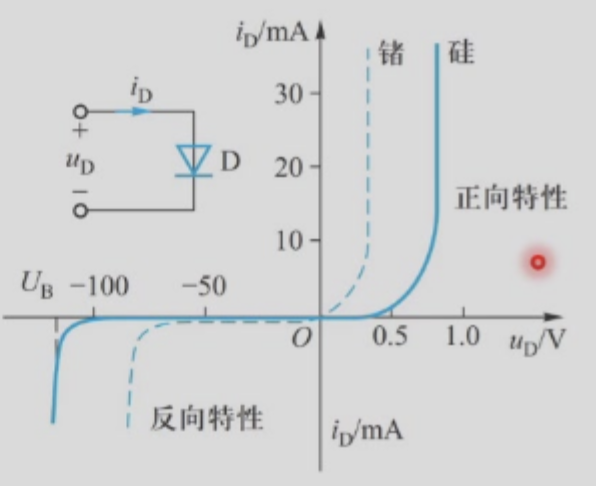
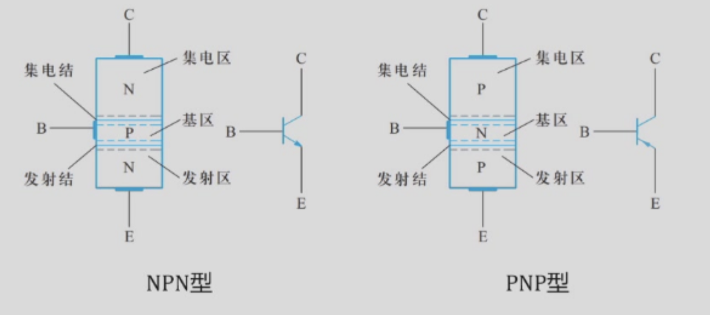
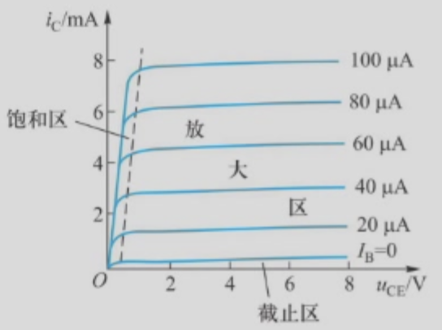
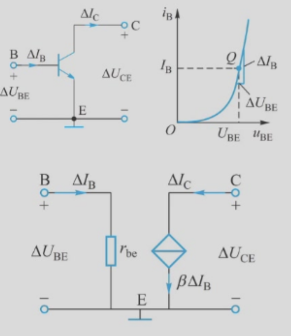

这节课主要介绍晶体管，pn结原理与二极管电路计算

## PN结
PN结主要材料一般都是半导体。
### 半导体种类
有如下常用半导体种类：
- 本征半导体：纯净的半导体（如硅、锗、碳化硅、氮化镓等）
，载流子是**自由电子（带负电）和空穴（带正电）**
- P型半导体：在纯净的半导体硅、锗中掺入少量三价元素
，多数载流子为**空穴带正电（Positive）**
- N型半导体：在纯净的半导体硅、锗中掺入少量五价元素
，多数载流子为**电子带负电（Negative）**

### 不同的激发状态
对于不同半导体，其激发状态都是不同的，例如本征半导体的技法状态就是**本征激发**，同时存在着自由电子和空穴

类似地，N型也有类似地情况，但是N型内部嵌入了5价元素，导致电子多余量变多，P型半导体则是嵌入3价元素，导致空穴比较多

::fold{title="注意" expand info}
虽然p，n型的内部载流子种类占比不同，但是总体两者都是显正电性
::

那么，用专门的制造工艺在同一块半导体单晶上，形成P型半导体区域和N型半导体区域，在这两个区域的交界处就形成一个**PN结**。

### pn结的单向导电性

由于扩散效应，P区域多出的空穴会向N区域移动，反之N区域多出的电子会向着P区域移动，而这样就会在原来的位置产生电性偏移（空穴移开显负电，反之亦然），这样就会形成一个内电场

其中，多数载流子会被扩散效应推动进行扩散，而少数载流子会被内电场控制进行偏移，两者会达到一个平衡。

平衡过后，中间形成的这个有内部电场的空间电荷区的宽度就会稳定下来

那么，如果在这种情况下，我们尝试对PN结外部加上一个电场，就会出现正偏与反偏的情况

#### PN结的正偏

如果对P区加上高电位，N区加上低电位，那么P区空穴被推向中间空间电荷区，电子推向高电位侧的趋势就会变大，N区相反但是效果是一样的，那么就会导致中间的空间电荷区变小，此时内部的阻值很小，PN结的压降很低，此时认为**正向导通**

#### PN结的反偏

类似地，如果加上相反的电位，也就是N级高电位，P级低电位，则会出现反偏现象，此时中间的空间电荷区变大，此时内部的阻值变大，PN结的压降很高，甚至会导致开路，此时认为**反向截止**

### 二极管的特性和主要参数

观察二极管的伏安特性曲线

1. 正向特性：
- 死区：电压小，基本不导通。
- 死区电压：硅管0.6~0.7V，锗管0.2~0.3V。
- 非线性区：一开始导通，电流小
- 导通区：一近似线性

2. 反向特性
- 正常工作区：截止，反向电流很小
- 反向击穿区：反向电压过大，反向击穿

::fold{title="**二极管电路的分析方法**" expand success}
分析关键：判断二极管是否导通

单个二极管：阳极电位高于阴极电位足够大小；

多个二极管：
- 阳极接于同一点（同电位），阴极电位最低的优先导通；
- 阴极接于同一点（同电位），阳极电位最高的优先导通。
::

## 三极管

三极管有两个PN结组成，分为三个电极以及三个区

三极管本质上是一个小信号模型（处于放大区时），由**基极**电流控制，我们可以认为通过基极来控制最后**发射极**的流出电流量，配合**集电极**的输入电流来调整电路的电流状态

::fold{title="**为什么三极管能调节电流**" expand success}
电流关系满足：
$$
\begin{aligned}
        I_E &= I_B + I_C \\
        I_B &\ll I_E \approx I_C  \to \\
        \Delta I_B &\to \Delta I_C,\Delta I_E
\end{aligned}
$$
于是能够做到以小电流改变整体电路的电流情况
::

三极管存在三种状态:

- **截止状态**:阀门完全关闭，**集电结、发射结均反向偏置**
- **放大状态**:阀门半开，可控：小电流控制大电流，**发射结正向偏置，集电结反向偏置**
- **饱和状态**:阀门完全打开：$I_C$达到极限，不再随$I_B$变化，**发射结、集电结均正向偏置**

::fold{title="**有关放大状态的电流与载流子分析**" expand info}
**放大状态**：

发射结外电场$\to$发射区大量电子载流子向基区运动，电源向发射区补充电子$\to$发射极电流IE
进入基区的电子载流子少量与基区空穴复合，电源$U_{BB}$
向基区补充空穴$\to$基极电流$I_B$

集电结外电场$\to$集电结反偏$\to$推动少子运动（电子），进入集电区并由电源收集$\to$集电极电流$I_C$
::

三极管的正向输入特性没什么特别的，和二极管类似

存在两个需要注意的参数：

- **电流放大参数**：
$$
    \bar \beta = \frac{I_C - I_{CEO}} {I_B} \approx \frac {I_C} {I_B}
$$

- **穿透电流$I_{CEO}$**：指基极开路时，集电极到发射极间的反向截止电流

### 简化的小信号模型

当晶体管处于放大区的时候，可以认为是一个**CCCS受控源**，也就是发射极电流受基极控制的受控源，此时我们可以等价有如下电路，并给出对应的特性分析曲线

当研究$U_{BE}$时，存在如下关系：
$$r_{be} = \frac{\Delta U_{BE}}{\Delta I_B} = r_b + (1 + \beta)\frac{26mV}{I_E}$$

$r_b = 200\Omega$ 基区体电阻

$I_E$ 静态发射极电流 (mA)

26mV 是室温下的固定值

而研究$U_{CE}$时，存在如下关系：
$$
\Delta I_C = \beta \Delta I_B
$$

### $^\ast$绝缘栅场效应晶体管

内容查看相关资料即可，不过多介绍