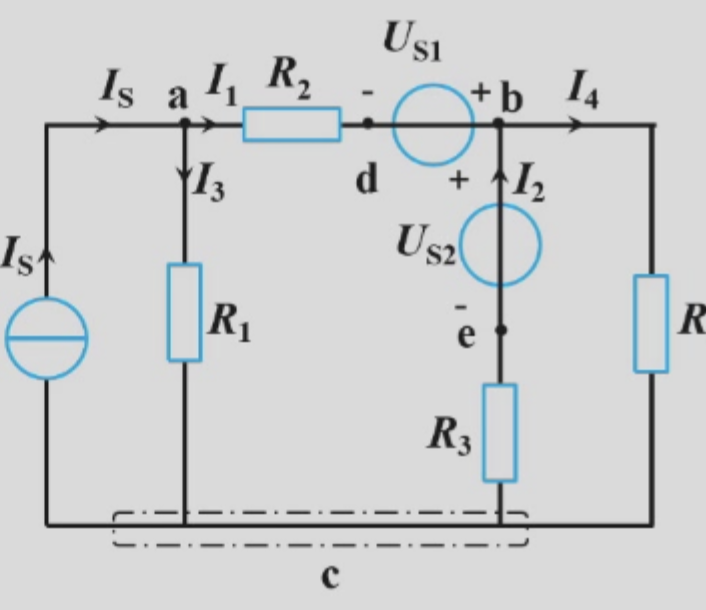
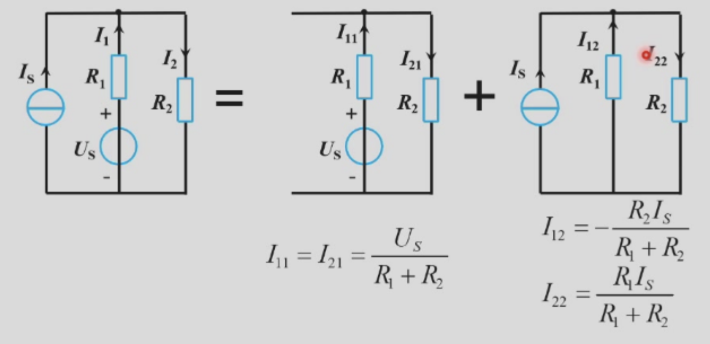

本节课我们主要学习电路分析的一些初步方法

## 支路电流法

支路电流法是直接对某一条支路进行直接电流电压值计算的方法，其原理是基尔霍夫定律

### 基尔霍夫定律

下面是一个说明用的电路示意图：

::fold{title="**名词解释**" expand info}
**节点**：三个或三个以上电路元件的连接点称为节点

**支路**：连接两个结点之间的电路称为支路

**回路**：电路中任一闭合路径称为回路

**网孔**：电路中最简单的单孔回路内部没有支路的回路
::

#### **基尔霍夫电流定律（Kirchhoff's Current Law）**
在任何电路中，离开（或流入）任何节点的所有支路电流的代数和在任何时刻都等于零
$$
\sum i_{out} = \sum i_{in} = 0 
$$

对于上面给出的示意图的节点b就是以下算式：

$$-I_1 - I_2 + I_4 = 0$$

本质上是**电流连续性原理**

#### 基尔霍夫电压定律（Kirchhoff’s Voltage Law）
在任何电路中，形成任何一个回路的所有支路沿同一循行方向电压的代数和在任何时刻都等于零
$$
  \sum u = 0
$$

对于上面给出的示意图的最右侧单元回路就是以下算式：

$$R_4I_4 + R_3I_2 - U_{S2} = 0$$

::fold{title="注意" expand warning}
考虑有电源的时候需要利用的是**关联参考方向**
::

学习上述两种定理能够得到我们的第一种电路分析方法：**支路电流法**

### 支路电流法的列式思路

对于支路电流法的列式分析我们一般需要考虑两个步骤，第一步是KCL，第二步是KVL

1. 标出各支路电流的参考方向。支路数b（=5）
2. 列节点的KCL电流方程式。节点数n（=3），则可建立（n-1）个独立方程式
3. 列写回路的KVL电压方程式，电压方程式的数目为$I=［b-(n-1)］(=3)$个
4. 联立求解

我们有一些需要注意的特殊情况：
::fold{title="**关于存在受控电流源与电流源的情况**" expand success}
存在**电流源**的时候，一条支路的电流是固定已知的，所以可以少列一个KCL方程
存在**受控电流源**的时候，存在两个电流的关系，相当于也提供了一个独立KCL方程

::

## 等效电路法

了解等效电路法需要先学习两个定理，一个是叠加定理，另外一个是等效电源原理

### 叠加定理

一个线性的电路有什么特点？

1. **齐次性**：设电路中电源的大小为x（激励），因该激励在电路某支路产生的电流或电压为y（响应），则有：
$$y=kx$$
其中k为任意常数

2. **叠加性**：设电路中多个激励的大小分别为$x_1,x_2,…,$在电路某支路产生相应的电流或电压（响应）为满足齐次性的数个响应$y_1,y_2,…,$，则全响应为：
$$y=k_1x_1+k_2x_2+…=y_1+y_2+…$$

::fold{title="**激励与响应**" expand info}
在电路原理中，**激励 (Excitation)** 指的是**外界施加给电路的能量或信号**。它是引起电路中产生电压和电流变化的根本原因

在电路分析以及更广泛的系统理论中，我们通常把电路看作一个处理系统
* **激励（原因 / 输入）：** 外界加在电路特定端口上的电压或电流
* **响应（结果 / 输出）：** 在激励的作用下，电路内部各个元件或分支上产生的电压和电流（比如某个电阻上的压降，或者流过某个电感的电流）

在具体的电路模型中，激励通常由**独立电源**来提供，主要包括：
* **独立电压源**：向电路强制提供特定的电压变化规律。
* **独立电流源**：向电路强制提供特定的电流变化规律。

*(注意：受控源虽然也叫“源”，但它们的大小依赖于电路中其他位置的电压或电流，属于电路内部的约束关系，因此在分析时不被视作外部激励。)*

::

**叠加定理**：对于一个**线性电路**来说，由几个**独立电源**共同作用所产生的某一支路**电流或电压**，等于各个独立电源单独作用时分别在该支路所产生的电流或电压的**代数和**。当某一个独立电源单独作用时，其余的独立电源应除去。

例如：

电压源$\to$短路处理  电流源$\to$断路处理

### 等效电源定理

等效源定理包括**戴维南定理（Thevenin theorem）**和**诺顿定理（Norton theorem）**，是计算复杂线性网络的一种有力工具

简单来说，前者是等效为**电压源串联电阻**，后者为等效为**电流源并联电阻**

::fold{title="**注意**" expand warning}
1. 被等效的二端网络必须是线性的

2. 二端网络与外电路之间没有耦合关系
::

那么对于等效后的电源，我们需要分析其等效电源与等效电阻，其中等效电源求开路电压即可，而等效电阻可以有三种方法：

1. 利用电阻串、并联的方法化简：按照“电压源$\to$短路处理  电流源$\to$断路处理”的逻辑处理，但是对于一些较为复杂的电桥会相对麻烦，以及不允许存在**受控源**的电路使用

2. 外施电压法：假定外部有一个测试用电压源，按照“电压源$\to$短路处理  电流源$\to$断路处理”的逻辑处理，但是对于受控源不能使用前面的逻辑处理简化

3. 开短路法：直接对开路电流电压分析

值得注意的是，（2.）这里简化之后的分析就是上面提到的支路分析法