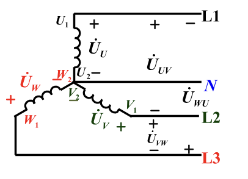
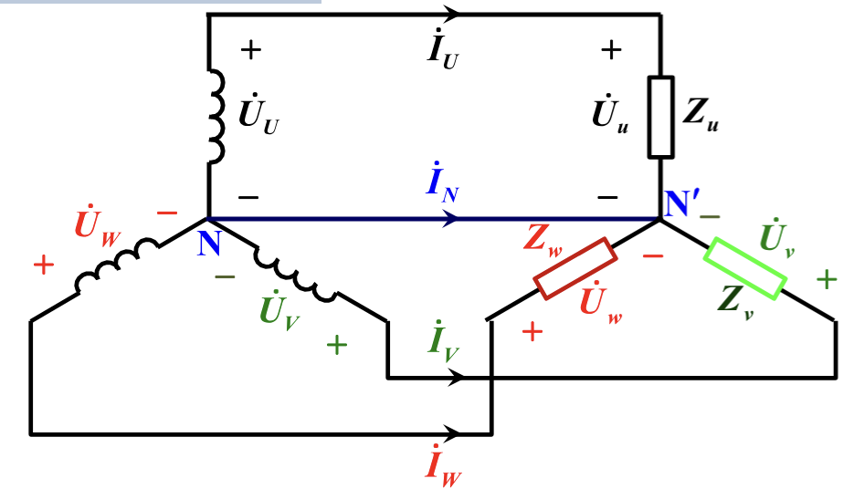
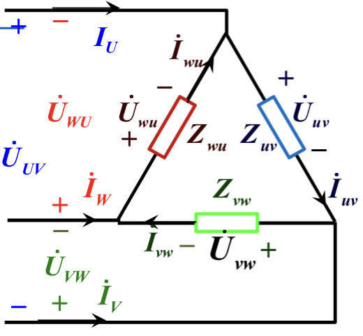

本节课主要介绍三项电路的内容

## 定义
什么是**三相电路**，以及什么是**三相电源**？

**三相电源**：由三个幅值相等、频率相同、相位互差120°的单相交流电源构成
**三相电路**：由三相电源构成的电路

其中，L是从始端引出的三条相线，称为**火线**，而三线汇聚联结就得到**联结点**，或称**零点**，可以引出**中性线**N，称为**零线**，通常接地

没有中性线的为**三相三线制**，反之为**三相四线制**
从三相四线制来理解：各相线与中性线之间的电压，称为**相电压**，相线与相线之间的电压称为**线电压**

当三相电源的电压幅值相同，相位相差120度的时候，就称为**对称三相电源**

其中我们有两种联结标准，为**星型**与**三角形**。
::grid{align=equal gapx=10px gapy=20px}
:sep{span=12}
:::fold{title="**star**" expand always success}

:::
:sep{span=12}
:::fold{title="**triangle**" expand always success}

:::
::

## 计算方法

有两种分类标准：是**星型**还是**三角形**，是**对称**还是**不对称**

### 对称三相电源

**星形**：

电流：$I_L = I_{ph}$

电压：$U_L = \sqrt{3} U_{ph}$

**三角形**：

电流：$I_L = \sqrt{3} I_{ph}$
电压：$U_L = U_{ph}$

两种联结方式的功率公式相同：
$$P = \sqrt{3} U_L I_L \cos\varphi$$
$$Q = \sqrt{3} U_L I_L \sin\varphi$$
$$S = \sqrt{3} U_L I_L$$

### 非对称三相电源

**星形**：

其中需要分类为有中性线和没有中性线来讨论：

有中性线：

电流：$I_L = I_{ph}$

中性线电流：
$$\dot{I}_N = \dot{I}_A + \dot{I}_B + \dot{I}_C$$

电压：$U_L = \sqrt{3} U_{ph}$

无中性线：

这种情况比较麻烦，需要先算**中性点位移电压**：
$$\dot{U}_{N'N} = \frac{\frac{\dot{U}_A}{Z_A} + \frac{\dot{U}_B}{Z_B} + \frac{\dot{U}_C}{Z_C}}{\frac{1}{Z_A} + \frac{1}{Z_B} + \frac{1}{Z_C}}$$

然后需要算出真实相电压：
$$\dot{U}_{A'} = \dot{U}_A - \dot{U}_{N'N}$$
其他两者类似

然后再去算相电流：
$$\dot{I}_A = \frac{\dot{U}_{A'}}{Z_A}, \quad \dot{I}_B = \frac{\dot{U}_{B'}}{Z_B}, \quad \dot{I}_C = \frac{\dot{U}_{C'}}{Z_C}$$

**三角形**：

电流：
$$\dot{I}_{AB} = \frac{\dot{U}_{AB}}{Z_{AB}}, \quad \dot{I}_{BC} = \frac{\dot{U}_{BC}}{Z_{BC}}, \quad \dot{I}_{CA} = \frac{\dot{U}_{CA}}{Z_{CA}}$$

其中线电流：
$$\dot{I}_A = \dot{I}_{AB} - \dot{I}_{CA}$$
其他两者类似

电压：
$$\dot{U}_{AB} = \dot{U}_{L(AB)}, \quad \dot{U}_{BC} = \dot{U}_{L(BC)}, \quad \dot{U}_{CA} = \dot{U}_{L(CA)}$$

两种联结方式的功率公式相同：
$$P = \sqrt{3} U_L I_L \cos\varphi$$
$$Q = \sqrt{3} U_L I_L \sin\varphi$$
$$S = \sqrt{3} U_L I_L$$

